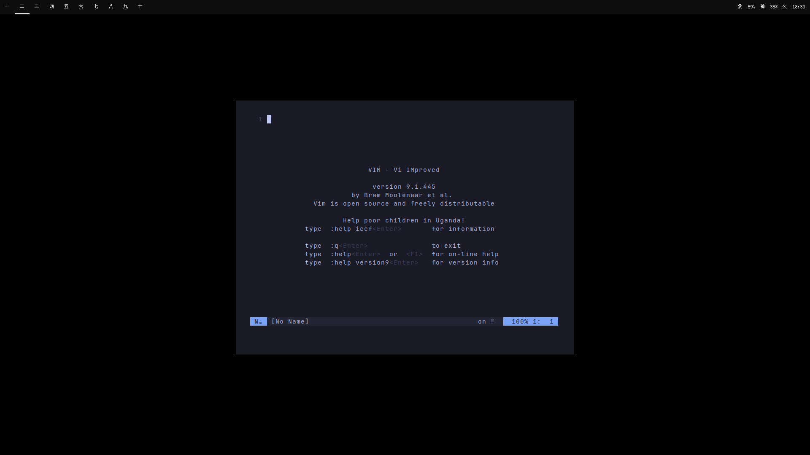

<h1> <center> Vim </center> </h1>

<b> <center> Hi, this is my vim configuration: </b> </center>



> How to install? 


 First install [Plug](https://github.com/junegunn/vim-plug), the package manager used in this configuration. 
```bash
curl -fLo ~/.vim/autoload/plug.vim --create-dirs \
    https://raw.githubusercontent.com/junegunn/vim-plug/master/plug.vim
```
<br> 

After that, run the vim configuration installation script.

```bash
git clone https://github.com/jotarodriguesBR/vim && mv vim/.vimrc $HOME && vim -c :PlugInstall 
```
